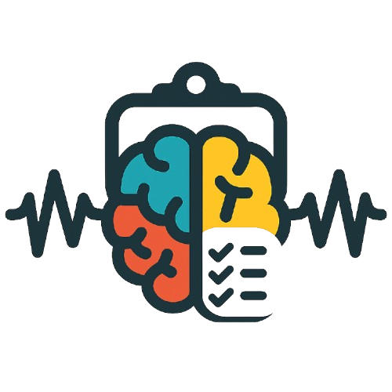

# NeurExp Tracker

A web application for tracking neuroimaging study acquisitions — designed for research labs running experiments on **MEG**, **3T MRI**, and/or **7T MRI** machines.

Built to replace scattered spreadsheets with a single, structured tool that follows participants from recruitment all the way through every session and run.

---

## 🧠 What it does

Running a neuroimaging study involves juggling a lot of information: who has been recruited, which sessions have been done on which machine, how each run went, whether the anatomical MRI was acquired… NeurExp Tracker puts all of that in one place.

You create a study, add participants, and record each acquisition session as it happens. The app keeps track of progress and lets you export clean reports at any time.

---

## ✨ Features

### 📁 Studies
- Create a study with a name, description, and configuration (expected number of participants, sessions per participant, runs per session, resting-state acquisitions)
- Select one or more machine types: **MEG**, **3T MRI**, **7T MRI**
- Edit study parameters at any time
- Delete a study (with confirmation)

### 👤 Participants
- Add participants one by one with a **Subject ID** (e.g. `sub-01`, auto-generated), a **NIP**, optional age, **gender** (♂ / ♀), **handedness** (right / left), and acquisition date
- **Bulk import** from a spreadsheet: copy-paste directly from Excel or Google Sheets — the app parses the data, shows a preview with validation, and imports all valid rows at once. Recognised columns (any order): `Subject`, `NIP`, `Age`, `Acq. Date` / `First acq. date`, `Gender`, `Handedness` / `Laterality`, `MRI anat`. Date format: `DD/MM/YY` or `DD/MM/YYYY`. Gender values: `M`/`F`, `male`/`female`, `homme`/`femme`. Handedness values: `R`/`L`, `right`/`left`, `Right-handed`/`Left-handed`, `droite`/`gauche`. MRI anat: `✅ [3T 05/06/24]` (extracts both acquisition flag and date).
- Search participants by subject ID or NIP
- Filter by status: Recruited / Upcoming / Completed
- Add free-text **notes** per participant (contraindications, preferences, contacts, etc.)
- Track **anatomical MRI** acquisition (3T and/or 7T) with optional date per participant
- Delete a participant (with confirmation)

### ⚡ Acquisition workflow
When starting a session for a participant, a step-by-step wizard guides you through:

1. **Machine selection** — choose which machine this session is for (skipped if the study uses only one machine)
2. **Preparation checklist** — go through each item one at a time; each step must be explicitly confirmed before moving to the next
3. **Session notes** — optional free-text field to capture overall session quality, setup issues, or anything that affects the whole session
4. **Runs** — for each run, record:
   - Participant state: 😀 Alert · 😐 Neutral · 😴 Drowsy · 😵 Struggling · 😰 Anxious · 🏃 Moved excessively
   - Whether it is a resting-state run (if applicable)
   - Optional per-run notes
5. **MEG wrap-up** *(MEG sessions only)* — a mandatory end-of-session checklist:
   - Shut down the videoprojector ✓
   - Clean the electrodes ✓
   - Put the MEG in liquefaction mode *(if last experiment of the day)*

   The "Done" button is locked until the first two items are checked.

### 🗂️ Session & run management
From the participant detail page you can also:
- **Manually add a session** to any machine track (e.g. to log a session recorded outside the wizard)
- **Delete a session** (with confirmation)
- **Add or delete individual runs** within a session
- **Edit run notes and participant state** inline at any time

### 📊 Progress tracking
- Study-level progress bar: counts participants with status "Completed" vs the expected total
- Per-participant session progress: tracks completed sessions across all machine types
- Per-machine progress bars on the machine selection screen

### 📤 Exports
- **HTML report** (study-level): full overview of all participants (including gender and handedness), sessions, and runs, with a tab per participant — self-contained file, no internet required
- **HTML report** (participant-level): detailed view of a single participant's entire history
- **CSV export**: one row per participant, columns include Gender and Handedness, ready to open in Excel or R

### 💾 Data persistence
All data is stored locally in your browser's **localStorage** — nothing is sent to any server.

> ⚠️ **Clearing your browser data will permanently erase everything. Use the export features regularly as backups.** ⚠️

---

## 🚀 Getting started

### Prerequisites
- [Node.js](https://nodejs.org/) (v14 or higher recommended)
- npm (comes with Node.js)

### Installation

```bash
# Clone the repository
git clone https://github.com/your-username/neurexp-tracker.git
cd neurexp-tracker

# Install dependencies
npm install

# Start the development server
npm run dev
```

Then open [http://localhost:3000](http://localhost:3000) in your browser.

### Build for production

```bash
npm run build
```

The output will be in the `dist/` folder — ready to be served by any static file host.

---

## 🗺️ Quick walkthrough

**1. Create a study** — Click **New Study**, fill in the name, select your machines, set the expected participants and sessions. A preparation checklist is generated automatically and can be customised afterwards.

**2. Add participants** — Use **Add Participant** for individual entries or **Bulk Import** to paste from your existing spreadsheet. Only a NIP is required; the subject ID is auto-generated.

**3. Record a session** — Click the green **Acquire** button next to a participant. The wizard walks you through the checklist, session notes, and each run. Progress is saved automatically.

**4. Review and edit** — Click any participant to see their full history — all sessions, runs, notes. Edit inline at any time.

**5. Export** — Use **CSV** or **HTML Report** on the study page to back up or share your data.

---

## 🛠️ Tech stack

| Layer | Technology |
|---|---|
| Framework | React 18 + TypeScript |
| Bundler | Vite |
| Styling | Tailwind CSS |
| State / persistence | Zustand + localStorage |
| Routing | React Router v6 |
| Icons | Lucide React |
